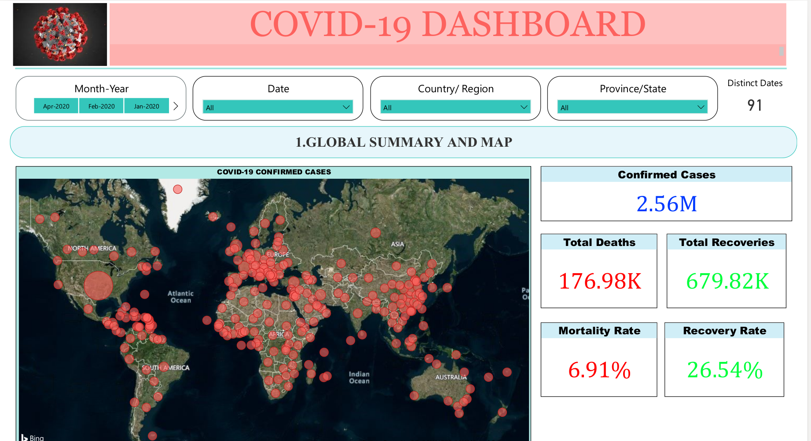
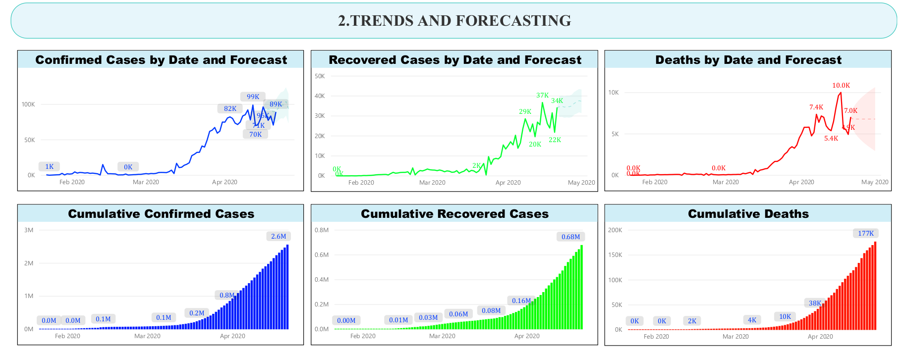
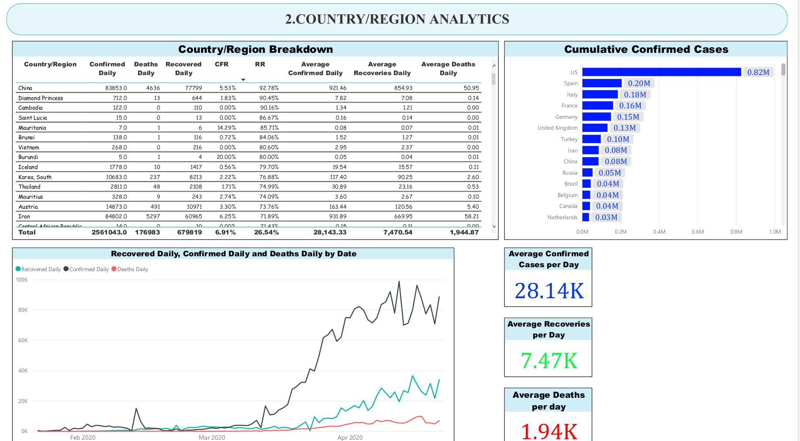

# COVID-19 Dashboard

A **COVID-19 Data Analysis and Visualization Dashboard** built using **Power BI and Python** to analyze, visualize, and understand COVID-19 trends and statistics.

Power BI is a business intelligence and data visualization platform used to transform raw data into meaningful insights through interactive dashboards, charts, tables, and reports.

### Prerequisites

* Power BI Desktop
* Python for Data Analysis
* Jupyter Notebook

## Getting Started

1. Install **Power BI Desktop** and open the `Dashboard-1.pbix` file.
2. Run the `Covid-19 Analysis.ipynb` notebook to process the COVID-19 dataset and generate the required dataset (`CoronaVirus PowerBI Raw`).
3. For the latest COVID-19 data, visit the official **JHU CSSE COVID-19 Data Repository**:
   https://github.com/CSSEGISandData/COVID-19

## Dashboard Features

* COVID-19 Summary Statistics
* COVID-19 Trends Analysis
* COVID-19 Forecasting
* COVID-19 Breakdown Analytics
* Country-wise COVID-19 Statistics
* Date-wise COVID-19 Statistics

## Dashboard Preview

The `dashboard-1.pdf` file provides a detailed preview of the dashboard.

## Acknowledgments

Special thanks to the **360 YP community** for their support and resources.

